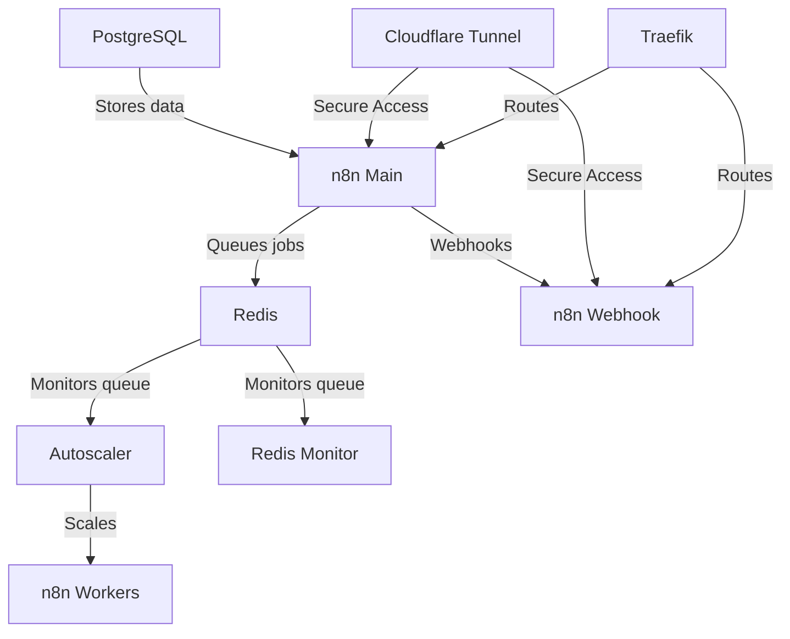

# n8n Autoscaling System

[](https://opensource.org/licenses/MIT)
[](https://www.docker.com/)
[](https://n8n.io/)

A production-ready Docker-based autoscaling solution for [n8n](https://n8n.io/) workflow automation platform. Dynamically scales worker containers based on Redis queue length without the complexity of Kubernetes or other orchestration platforms.

## ✨ Features

- 🚀 **Dynamic Autoscaling**: Automatically scales n8n workers based on queue length
- 🐳 **Docker Native**: Simple Docker Compose deployment, no complex orchestration needed
- 🔒 **Cloudflare Tunnel**: Secure external access without exposing ports
- 🌐 **Traefik Reverse Proxy**: Professional-grade routing for UI and webhooks
- 🕷️ **Web Scraping Ready**: Built-in Puppeteer and Chrome support
- 📊 **Queue Monitoring**: Real-time Redis queue monitoring service
- ⚡ **High Performance**: Tested with hundreds of simultaneous executions
- 🛡️ **Production Tested**: Proven on 8-core, 16GB RAM VPS
- 🔧 **Highly Configurable**: Fine-tune scaling behavior to your needs
- 💚 **Health Checks**: Comprehensive health monitoring for all services

## 📋 Table of Contents

- [Architecture](#architecture)
- [Prerequisites](#prerequisites)
- [Quick Start](#quick-start)
- [Configuration](#configuration)
- [Scaling Behavior](#scaling-behavior)
- [Monitoring](#monitoring)
- [Troubleshooting](#troubleshooting)
- [Advanced Usage](#advanced-usage)
- [Contributing](#contributing)
- [License](#license)
- [Acknowledgments](#acknowledgments)

## 🏗️ Architecture



### Components

- **n8n Main**: Main n8n instance handling UI and workflow management
- **n8n Workers**: Scalable worker instances executing workflows
- **n8n Webhook**: Dedicated webhook handler for better performance
- **Autoscaler**: Python service monitoring queue and scaling workers
- **Redis**: Queue management and caching
- **PostgreSQL**: Persistent workflow and execution data storage
- **Traefik**: Reverse proxy for routing traffic
- **Cloudflare Tunnel**: Secure tunnel for external access
- **Redis Monitor**: Real-time queue monitoring and logging

## 📦 Prerequisites

- **Docker** v20.10 or higher
- **Docker Compose** v2.0 or higher
- **Cloudflare Account** (for tunnel setup)
- **Domain Name** (optional, for custom domains)
- **Min 4GB RAM** (8GB+ recommended for production)
- **Min 2 CPU cores** (4+ recommended for production)

### Installation Recommendations

- **New Users**: [Docker Desktop](https://www.docker.com/products/docker-desktop/)
- **Ubuntu/Debian**: Use the [Docker convenience script](https://docs.docker.com/engine/install/ubuntu/#install-using-the-convenience-script)

## 🚀 Quick Start

### Step 1: Clone the Repository

```bash
git clone https://github.com/barisariburnu/n8n-autoscaling.git
cd n8n-autoscaling
```

### Step 2: Configure Environment

```bash
# Copy the example environment file
cp .env.example .env

# Edit the .env file with your settings
# IMPORTANT: Change these values:
# - POSTGRES_PASSWORD
# - N8N_ENCRYPTION_KEY (32 characters)
# - N8N_USER_MANAGEMENT_JWT_SECRET
# - N8N_RUNNERS_AUTH_TOKEN
# - CLOUDFLARE_TUNNEL_TOKEN
# - N8N_HOST, N8N_WEBHOOK, and related domain settings
```

### Step 3: Set Up Cloudflare Tunnel

1. Go to [Cloudflare Zero Trust](https://one.dash.cloudflare.com/)
2. Create a new tunnel
3. Configure your domains (e.g., `n8n.yourdomain.com`, `webhook.yourdomain.com`)
4. Copy the tunnel token to `.env` file (`CLOUDFLARE_TUNNEL_TOKEN`)

For detailed instructions, see the [step-by-step guide](https://www.reddit.com/r/n8n/comments/1l9mi6k/major_update_to_n8nautoscaling_build_step_by_step/).

### Step 4: Create Docker Network

```bash
docker network create shark
```

> **Note**: The `shark` external network makes it easier to connect other containers later. If you don't need this, comment out the shark network sections in `docker-compose.yml`.

### Step 5: Start Services

```bash
docker compose up -d
```

### Step 6: Access n8n

Open your browser and navigate to your configured n8n URL (e.g., `https://n8n.yourdomain.com`).

## ⚙️ Configuration

### Critical Security Settings

⚠️ **IMPORTANT**: Always change these values in your `.env` file:

```bash
POSTGRES_PASSWORD=your_strong_password_here
N8N_ENCRYPTION_KEY=your_32_character_key_here
N8N_USER_MANAGEMENT_JWT_SECRET=your_secret_here
N8N_RUNNERS_AUTH_TOKEN=your_token_here
```

### Autoscaling Parameters

| Variable | Description | Default | Recommended |
|----------|-------------|---------|-------------|
| `MIN_REPLICAS` | Minimum worker containers | `1` | `1-2` |
| `MAX_REPLICAS` | Maximum worker containers | `5` | `3-10` |
| `SCALE_UP_QUEUE_THRESHOLD` | Queue length to trigger scale up | `5` | `5-20` |
| `SCALE_DOWN_QUEUE_THRESHOLD` | Queue length to trigger scale down | `1` | `1-5` |
| `POLLING_INTERVAL_SECONDS` | Queue check frequency | `10` | `10-60` |
| `COOLDOWN_PERIOD_SECONDS` | Wait time between scaling actions | `10` | `60-300` |

### Worker Configuration

| Variable | Description | Default |
|----------|-------------|---------|
| `N8N_CONCURRENCY_PRODUCTION_LIMIT` | Concurrent tasks per worker | `10` |
| `N8N_QUEUE_BULL_GRACEFULSHUTDOWNTIMEOUT` | Graceful shutdown timeout (seconds) | `300` |
| `N8N_GRACEFUL_SHUTDOWN_TIMEOUT` | Worker shutdown timeout (seconds) | `300` |

> **Tip**: Set timeout values greater than your longest workflow execution time.

### Domain Configuration

```bash
N8N_HOST=n8n.yourdomain.com
N8N_WEBHOOK=webhook.yourdomain.com
N8N_WEBHOOK_URL=https://webhook.yourdomain.com
N8N_EDITOR_BASE_URL=https://n8n.yourdomain.com
```

### Optional: Tailscale Integration

For secure PostgreSQL access via Tailscale:

```bash
TAILSCALE_IP=100.x.x.x  # Your Tailscale IP
```

## 📈 Scaling Behavior

The autoscaler monitors the Redis queue and scales workers according to these rules:

### Scale Up

Triggers when:
- Queue length > `SCALE_UP_QUEUE_THRESHOLD`
- Current workers < `MAX_REPLICAS`
- Cooldown period has elapsed

Action: Adds one worker (incremental scaling)

### Scale Down

Triggers when:
- Queue length < `SCALE_DOWN_QUEUE_THRESHOLD`
- Current workers > `MIN_REPLICAS`
- Cooldown period has elapsed

Action: Removes one worker (incremental scaling)

### Cooldown Period

After each scaling action, the autoscaler waits for `COOLDOWN_PERIOD_SECONDS` before the next scaling decision. This prevents rapid scaling oscillations.

## 📊 Monitoring

### View All Logs

```bash
docker compose logs -f
```

### View Specific Service Logs

```bash
# Autoscaler logs
docker compose logs -f n8n-autoscaler

# Worker logs
docker compose logs -f n8n-worker

# Queue monitor logs
docker compose logs -f redis-monitor

# Main n8n logs
docker compose logs -f n8n
```

### Check Queue Length

```bash
# Using Redis CLI
docker compose exec redis redis-cli LLEN bull:jobs:wait

# Or using the monitor service (check logs)
docker compose logs redis-monitor
```

### Check Service Health

```bash
docker compose ps
```

### Check Current Workers

```bash
docker compose ps | grep n8n-worker
```

## 🔧 Troubleshooting

### Workers Not Scaling

1. Check autoscaler logs:
   ```bash
   docker compose logs -f n8n-autoscaler
   ```

2. Verify `COMPOSE_PROJECT_NAME` matches your project:
   ```bash
   docker compose config | grep name
   ```

3. Check Redis connection:
   ```bash
   docker compose exec redis redis-cli ping
   # Expected output: PONG
   ```

### Queue Issues

Check queue manually:
```bash
docker compose exec redis redis-cli LLEN bull:jobs:wait
```

For BullMQ v4+:
```bash
docker compose exec redis redis-cli LLEN bull:jobs:waiting
```

### Webhook Not Working

Webhook URL format:
```
https://webhook.yourdomain.com/webhook/YOUR-WEBHOOK-ID
```

Check webhook container is running:
```bash
docker compose ps n8n-webhook
```

### Database Connection Issues

1. Check PostgreSQL is healthy:
   ```bash
   docker compose exec postgres pg_isready -U postgres
   ```

2. Verify credentials in `.env` file

3. Check PostgreSQL logs:
   ```bash
   docker compose logs postgres
   ```

### Cloudflare Tunnel Issues

1. Verify tunnel token in `.env`
2. Check cloudflared logs:
   ```bash
   docker compose logs cloudflared
   ```
3. Verify tunnel configuration in Cloudflare dashboard

### Performance Issues

1. Increase `MAX_REPLICAS` for more workers
2. Decrease `SCALE_UP_QUEUE_THRESHOLD` for faster scaling
3. Decrease `COOLDOWN_PERIOD_SECONDS` (carefully, to avoid oscillation)
4. Increase server resources (CPU, RAM)

## 🎯 Advanced Usage

### Without Cloudflare Tunnel

If you don't want to use Cloudflare Tunnel:

1. Check branches for version without cloudflared
2. Or comment out the `cloudflared` service in `docker-compose.yml`
3. Configure your own reverse proxy or port forwarding

### Custom Network Configuration

To use a different external network:

```bash
# Create your network
docker network create mynetwork

# Update docker-compose.yml
# Change 'shark' to 'mynetwork' in all network references
```

### Scaling Configuration for Different Workloads

**Light Workload** (occasional tasks):
```bash
MIN_REPLICAS=1
MAX_REPLICAS=3
SCALE_UP_QUEUE_THRESHOLD=10
SCALE_DOWN_QUEUE_THRESHOLD=2
```

**Medium Workload** (regular tasks):
```bash
MIN_REPLICAS=2
MAX_REPLICAS=5
SCALE_UP_QUEUE_THRESHOLD=5
SCALE_DOWN_QUEUE_THRESHOLD=1
```

**Heavy Workload** (continuous high-volume):
```bash
MIN_REPLICAS=3
MAX_REPLICAS=10
SCALE_UP_QUEUE_THRESHOLD=3
SCALE_DOWN_QUEUE_THRESHOLD=1
```

### PostgreSQL External Access

PostgreSQL is bound to Tailscale IP by default. To change:

```yaml
# In docker-compose.yml, modify postgres service ports:
ports:
  - "0.0.0.0:5454:5432"  # Bind to all interfaces
  # OR
  - "127.0.0.1:5454:5432"  # Bind to localhost only
```

## 🤝 Contributing

Contributions are welcome! Please read our [Contributing Guidelines](CONTRIBUTING.md) before submitting PRs.

1. Fork the repository
2. Create your feature branch (`git checkout -b feature/amazing-feature`)
3. Commit your changes (`git commit -m 'Add: Amazing feature'`)
4. Push to the branch (`git push origin feature/amazing-feature`)
5. Open a Pull Request

## 📝 Changelog

See [CHANGELOG.md](CHANGELOG.md) for a list of changes.

## 📄 License

This project is licensed under the MIT License - see the [LICENSE](LICENSE) file for details.

## 🙏 Acknowledgments

- [n8n](https://n8n.io/) - The amazing workflow automation platform
- [Cloudflare](https://www.cloudflare.com/) - Secure tunnel infrastructure
- [Traefik](https://traefik.io/) - Modern reverse proxy
- Original project inspiration and community feedback

## 📞 Support

- 🐛 [Report a Bug](https://github.com/barisariburnu/n8n-autoscaling/issues/new?template=bug_report.md)
- 💡 [Request a Feature](https://github.com/barisariburnu/n8n-autoscaling/issues/new?template=feature_request.md)
- 💬 [Ask a Question](https://github.com/barisariburnu/n8n-autoscaling/discussions)

## ⭐ Star History

If you find this project useful, please consider giving it a star! It helps others discover the project.

---

**Made with ❤️ by [barisariburnu](https://github.com/barisariburnu)**
